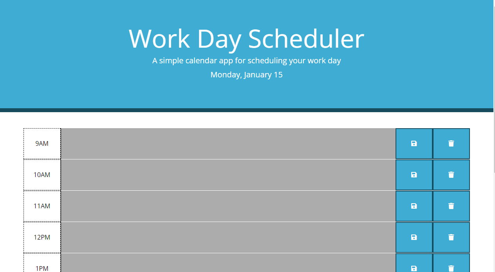

# work-day-scheduler

## Description
This project aims to create a Daily Planner App, showcasing skills in DOM manipulation, advanced JavaScript, Day.js library, and integration of third-party APIs. The deployed webpage serves as a comprehensive overview of the work and provides an easy way for others to connect.

The app runs in the browser and features dynamically updated HTML and CSS powered by jQuery.

## Features
- Each row in the display corresponds to a different time block, dynamically updated using jQuery.
- The JavaScript function responsible for creating rows compares each time block's hour to the current hour and applies the appropriate CSS class. This visual representation allows users to easily identify the current, past, and future hours.
- Users can input their tasks in the provided textarea and save them by clicking the designated button.
- Local storage is employed to persistently store all user inputs. Consequently, even after a page refresh, all tasks remain intact.

## Usage
Simply navigate to the application and interact with the intuitive user interface to manage your daily schedule effortlessly.

After opening the code in the browser the resulting analysis looks as following:

The [URL](https://paulinasiwko.github.io/work-day-scheduler/) of deployed application.

## Technologies Used

- 
-  
- 
- 
- Day.js
